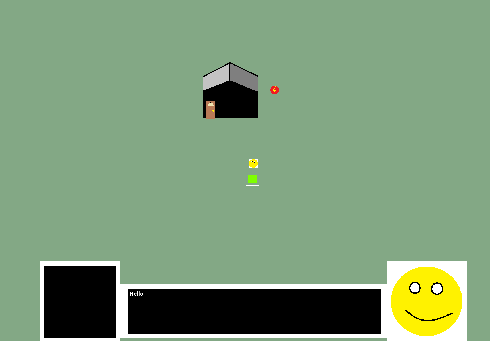
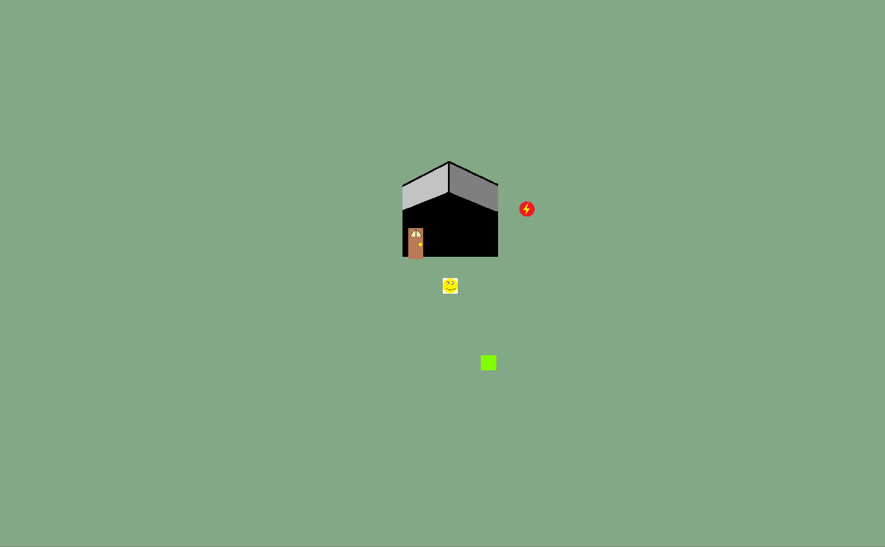
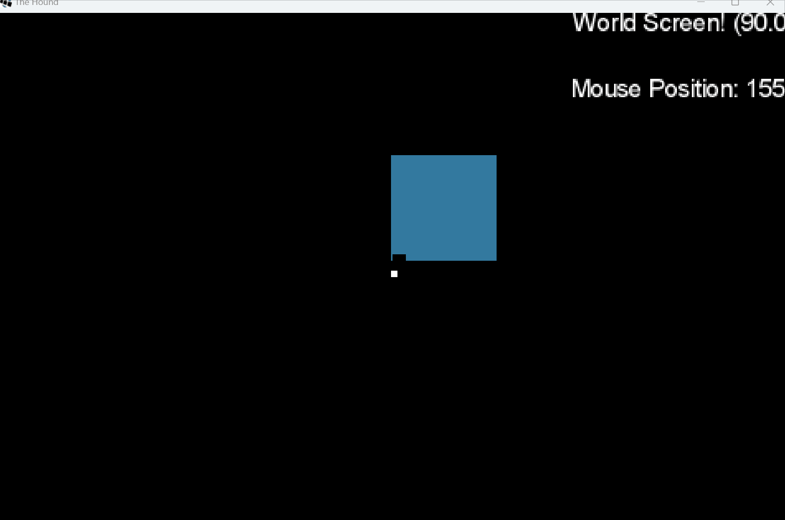

# TheHoundProofOfConcept
Small proof of concept projects for a larger rpg made in ligGDX.

Welcome to "The Hound" Proof of Concepts. These projects contain small proof on concept for a larger rpg game.
Everything was created using the libGDX framework with mostly java (some kotlin). The projects are not meant to be played
, but to show the different features of the game.

## Projects
### The Hound

Features:
- Dialgoue System: Talk to NPCs
- Highlight Objects with Mouse
- Powerups: Speed upgrade to move fast
- Movement and Collision
- Inventory System

### The Hound 2

Besides the obvious lack of rendering images, I mostly used this repo to test entering buildings and added a gun item in Kotlin. 

### The Hound NonGUI

I tried a different interface without using any images. Unfortunately, I didn't keep track of the project progress and I was the in the middle of implementing a complex
magic system based on mistborn. I did create a more robust NPC system with pathfinding and more dialogue.

## Notes for Future Me

In order to get each project to run, you have to seperately open them up so there are no issues with multiple gradle projects in the same folder. I also was unable to
setup my envinorment in VSCode successfully with gradle, so I would recommend Inteillj Community or Eclipse for libGDX projects.